# Markdown Issue Index

Generated by derive-tracker.wasm

## Ready Queue

| ID | Priority | Type | Assignee | Title | Labels |
| --- | ---: | --- | --- | --- | --- |
| [ISS-048](ISS-048.md) | 1 | task | unassigned | Lower Lane effect metadata to Buslane metadata | area/lanec, area/buslane, area/effects, agent |

## Unresolved Issues

| ID | Status | Priority | Type | Assignee | Blocked by | Blocks | Title |
| --- | --- | ---: | --- | --- | --- | --- | --- |
| [ISS-037](ISS-037.md) | open | 1 | epic | unassigned | ISS-048, ISS-049, ISS-050, ISS-051, ISS-052 | ISS-038 | Lower Lane effects into Buslane effect core |
| [ISS-038](ISS-038.md) | open | 1 | task | unassigned | ISS-037 | none | Complete Buslane effect v1 validation gates |
| [ISS-048](ISS-048.md) | open | 1 | task | unassigned | none | ISS-037, ISS-049 | Lower Lane effect metadata to Buslane metadata |
| [ISS-049](ISS-049.md) | open | 1 | task | unassigned | ISS-048 | ISS-037, ISS-050 | Lower Lane effect terms and latent function effects |
| [ISS-050](ISS-050.md) | open | 1 | task | unassigned | ISS-049 | ISS-037, ISS-051 | Lower Lane operation calls to Buslane perform |
| [ISS-051](ISS-051.md) | open | 1 | task | unassigned | ISS-050 | ISS-037, ISS-052 | Lower Lane handlers to Buslane handler tables |
| [ISS-052](ISS-052.md) | open | 1 | task | unassigned | ISS-051 | ISS-037 | Validate Lane effect lowering end to end |

## Dependency Graph

```mermaid
graph TD
  ISS_001["ISS-001: Fix lane run for local recursive function example"]
  ISS_002["ISS-002: Fix lane run for existential struct example"]
  ISS_003["ISS-003: Fix lane run for existential enum example"]
  ISS_004["ISS-004: Add semantic LSP navigation and hover support"]
  ISS_005["ISS-005: Preserve source identity in lanec analysis inputs"]
  ISS_006["ISS-006: Build a semantic index for Lane source analysis"]
  ISS_007["ISS-007: Implement LSP go-to-definition"]
  ISS_008["ISS-008: Implement LSP hover"]
  ISS_009["ISS-009: Support partial semantic analysis for LSP queries"]
  ISS_010["ISS-010: Convert Lane diagnostics to Rust-style reports"]
  ISS_011["ISS-011: Introduce structured diagnostic reports"]
  ISS_012["ISS-012: Rewrite syntax and formatter diagnostics"]
  ISS_013["ISS-013: Rewrite module and name resolution diagnostics"]
  ISS_014["ISS-014: Rewrite type, kind, and inference diagnostics"]
  ISS_015["ISS-015: Rewrite struct, record, type-member, and visibility diagnostics"]
  ISS_016["ISS-016: Rewrite pattern and match diagnostics"]
  ISS_017["ISS-017: Rewrite module interface, compile, link, and artifact diagnostics"]
  ISS_018["ISS-018: Rewrite artifact text parser diagnostics"]
  ISS_019["ISS-019: Rewrite CLI, LSP, and runtime boundary errors"]
  ISS_020["ISS-020: Add golden tests for Rust-style diagnostics"]
  ISS_021["ISS-021: Move compiler helper behavior onto owning methods"]
  ISS_022["ISS-022: Convert artifact text writing to ArtifactTextWriter methods"]
  ISS_023["ISS-023: Convert compile diagnostics rendering helpers to methods"]
  ISS_024["ISS-024: Move artifact model validation and conversion onto artifact methods"]
  ISS_025["ISS-025: Move analysis span helpers onto span-oriented methods"]
  ISS_026["ISS-026: Decide Buslane canonical text method or trait shape"]
  ISS_027["ISS-027: Deepen lane lsp workspace analysis module"]
  ISS_028["ISS-028: Clarify module input set error modes"]
  ISS_029["ISS-029: Concentrate lane command workflow locality"]
  ISS_030["ISS-030: Separate diagnostic presentation targets"]
  ISS_031["ISS-031: Add Buslane effect identities and effect terms"]
  ISS_032["ISS-032: Attach latent effects to Buslane function types"]
  ISS_033["ISS-033: Add Buslane perform and handler syntax to text roundtrip"]
  ISS_034["ISS-034: Implement canonical Buslane effect normalization"]
  ISS_035["ISS-035: Add Buslane verifier rules for effects and handlers"]
  ISS_036["ISS-036: Implement Buslane interpreter deep handlers"]
  ISS_037["ISS-037: Lower Lane effects into Buslane effect core"]
  ISS_038["ISS-038: Complete Buslane effect v1 validation gates"]
  ISS_039["ISS-039: Add Lane effect syntax and symbol namespaces"]
  ISS_040["ISS-040: Add Lane expression effect checking and operation calls"]
  ISS_041["ISS-041: Complete Lane handler checking and payload pattern lowering"]
  ISS_042["ISS-042: Add Lane handler source syntax"]
  ISS_043["ISS-043: Resolve and desugar Lane handler binders"]
  ISS_044["ISS-044: Check handler operation tables and payload patterns"]
  ISS_045["ISS-045: Check Lane handler result and resume types"]
  ISS_046["ISS-046: Lower handler payload patterns before Buslane alternatives"]
  ISS_047["ISS-047: Validate Lane handler checking end to end"]
  ISS_048["ISS-048: Lower Lane effect metadata to Buslane metadata"]
  ISS_049["ISS-049: Lower Lane effect terms and latent function effects"]
  ISS_050["ISS-050: Lower Lane operation calls to Buslane perform"]
  ISS_051["ISS-051: Lower Lane handlers to Buslane handler tables"]
  ISS_052["ISS-052: Validate Lane effect lowering end to end"]
  ISS_005 --> ISS_006
  ISS_006 --> ISS_007
  ISS_006 --> ISS_008
  ISS_007 --> ISS_009
  ISS_008 --> ISS_009
  ISS_011 --> ISS_012
  ISS_011 --> ISS_013
  ISS_011 --> ISS_014
  ISS_011 --> ISS_015
  ISS_011 --> ISS_016
  ISS_011 --> ISS_017
  ISS_011 --> ISS_018
  ISS_011 --> ISS_019
  ISS_012 --> ISS_020
  ISS_013 --> ISS_020
  ISS_014 --> ISS_020
  ISS_015 --> ISS_020
  ISS_016 --> ISS_020
  ISS_017 --> ISS_020
  ISS_018 --> ISS_020
  ISS_019 --> ISS_020
  ISS_022 --> ISS_024
  ISS_031 --> ISS_032
  ISS_031 --> ISS_033
  ISS_032 --> ISS_033
  ISS_031 --> ISS_034
  ISS_032 --> ISS_034
  ISS_033 --> ISS_035
  ISS_034 --> ISS_035
  ISS_035 --> ISS_036
  ISS_048 --> ISS_037
  ISS_049 --> ISS_037
  ISS_050 --> ISS_037
  ISS_051 --> ISS_037
  ISS_052 --> ISS_037
  ISS_036 --> ISS_038
  ISS_037 --> ISS_038
  ISS_035 --> ISS_039
  ISS_039 --> ISS_040
  ISS_042 --> ISS_041
  ISS_043 --> ISS_041
  ISS_044 --> ISS_041
  ISS_045 --> ISS_041
  ISS_046 --> ISS_041
  ISS_047 --> ISS_041
  ISS_040 --> ISS_042
  ISS_042 --> ISS_043
  ISS_043 --> ISS_044
  ISS_044 --> ISS_045
  ISS_045 --> ISS_046
  ISS_046 --> ISS_047
  ISS_035 --> ISS_048
  ISS_039 --> ISS_048
  ISS_040 --> ISS_048
  ISS_041 --> ISS_048
  ISS_048 --> ISS_049
  ISS_049 --> ISS_050
  ISS_050 --> ISS_051
  ISS_051 --> ISS_052
```

## Warnings

None.

