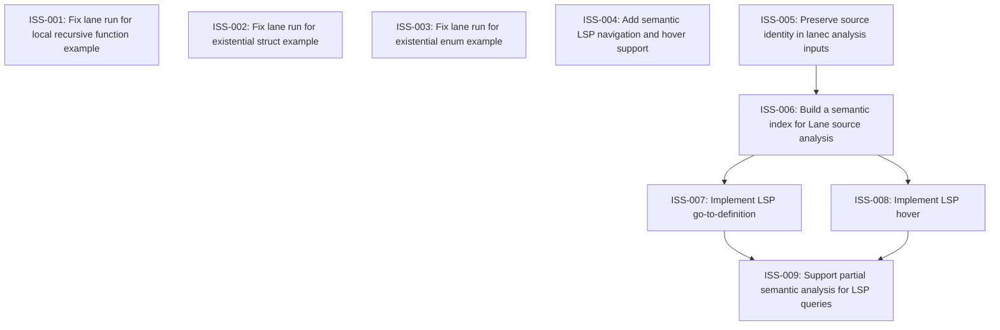

# Markdown Issue Index

Generated by derive-tracker.wasm

## Ready Queue

No ready issues.

## Unresolved Issues

No unresolved issues.

## Dependency Graph

```mermaid
graph TD
  ISS_001["ISS-001: Fix lane run for local recursive function example"]
  ISS_002["ISS-002: Fix lane run for existential struct example"]
  ISS_003["ISS-003: Fix lane run for existential enum example"]
  ISS_004["ISS-004: Add semantic LSP navigation and hover support"]
  ISS_005["ISS-005: Preserve source identity in lanec analysis inputs"]
  ISS_006["ISS-006: Build a semantic index for Lane source analysis"]
  ISS_007["ISS-007: Implement LSP go-to-definition"]
  ISS_008["ISS-008: Implement LSP hover"]
  ISS_009["ISS-009: Support partial semantic analysis for LSP queries"]
  ISS_005 --> ISS_006
  ISS_006 --> ISS_007
  ISS_006 --> ISS_008
  ISS_007 --> ISS_009
  ISS_008 --> ISS_009
```

## Warnings

None.

