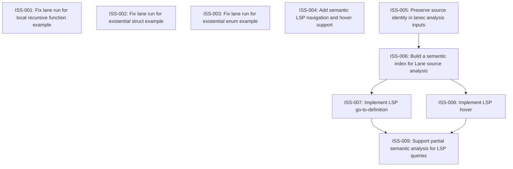

# Markdown Issue Index

Generated by derive-tracker.wasm

## Ready Queue

| ID | Priority | Type | Assignee | Title | Labels |
| --- | ---: | --- | --- | --- | --- |
| [ISS-004](ISS-004.md) | 1 | epic | unassigned | Add semantic LSP navigation and hover support | area/lsp, area/lanec, area/ide, agent |
| [ISS-005](ISS-005.md) | 1 | task | unassigned | Preserve source identity in lanec analysis inputs | area/lanec, area/lsp, area/analysis, agent |

## Unresolved Issues

| ID | Status | Priority | Type | Assignee | Blocked by | Blocks | Title |
| --- | --- | ---: | --- | --- | --- | --- | --- |
| [ISS-004](ISS-004.md) | open | 1 | epic | unassigned | none | none | Add semantic LSP navigation and hover support |
| [ISS-005](ISS-005.md) | open | 1 | task | unassigned | none | ISS-006 | Preserve source identity in lanec analysis inputs |
| [ISS-006](ISS-006.md) | open | 1 | task | unassigned | ISS-005 | ISS-007, ISS-008 | Build a semantic index for Lane source analysis |
| [ISS-007](ISS-007.md) | open | 1 | feature | unassigned | ISS-006 | ISS-009 | Implement LSP go-to-definition |
| [ISS-008](ISS-008.md) | open | 1 | feature | unassigned | ISS-006 | ISS-009 | Implement LSP hover |
| [ISS-009](ISS-009.md) | open | 2 | task | unassigned | ISS-007, ISS-008 | none | Support partial semantic analysis for LSP queries |

## Dependency Graph

## Warnings

None.

