# Markdown Issue Index

Generated by derive-tracker.wasm

## Ready Queue

| ID | Priority | Type | Assignee | Title | Labels |
| --- | ---: | --- | --- | --- | --- |
| [ISS-010](ISS-010.md) | 1 | epic | unassigned | Convert Lane diagnostics to Rust-style reports | area/diagnostics, area/ux, area/lanec, area/lane, agent |
| [ISS-013](ISS-013.md) | 1 | task | unassigned | Rewrite module and name resolution diagnostics | area/diagnostics, area/resolve, area/modules, agent |
| [ISS-014](ISS-014.md) | 1 | task | unassigned | Rewrite type, kind, and inference diagnostics | area/diagnostics, area/typecheck, area/kinds, agent |
| [ISS-015](ISS-015.md) | 1 | task | unassigned | Rewrite struct, record, type-member, and visibility diagnostics | area/diagnostics, area/typecheck, area/interfaces, agent |
| [ISS-016](ISS-016.md) | 1 | task | unassigned | Rewrite pattern and match diagnostics | area/diagnostics, area/patterns, area/typecheck, agent |
| [ISS-017](ISS-017.md) | 1 | task | unassigned | Rewrite module interface, compile, link, and artifact diagnostics | area/diagnostics, area/modules, area/artifacts, area/linker, agent |
| [ISS-018](ISS-018.md) | 2 | task | unassigned | Rewrite artifact text parser diagnostics | area/diagnostics, area/artifacts, area/parser, agent |
| [ISS-019](ISS-019.md) | 2 | task | unassigned | Rewrite CLI, LSP, and runtime boundary errors | area/diagnostics, area/cli, area/lsp, area/runtime, agent |

## Unresolved Issues

| ID | Status | Priority | Type | Assignee | Blocked by | Blocks | Title |
| --- | --- | ---: | --- | --- | --- | --- | --- |
| [ISS-010](ISS-010.md) | open | 1 | epic | unassigned | none | none | Convert Lane diagnostics to Rust-style reports |
| [ISS-013](ISS-013.md) | open | 1 | task | unassigned | none | ISS-020 | Rewrite module and name resolution diagnostics |
| [ISS-014](ISS-014.md) | open | 1 | task | unassigned | none | ISS-020 | Rewrite type, kind, and inference diagnostics |
| [ISS-015](ISS-015.md) | open | 1 | task | unassigned | none | ISS-020 | Rewrite struct, record, type-member, and visibility diagnostics |
| [ISS-016](ISS-016.md) | open | 1 | task | unassigned | none | ISS-020 | Rewrite pattern and match diagnostics |
| [ISS-017](ISS-017.md) | open | 1 | task | unassigned | none | ISS-020 | Rewrite module interface, compile, link, and artifact diagnostics |
| [ISS-020](ISS-020.md) | open | 1 | task | unassigned | ISS-013, ISS-014, ISS-015, ISS-016, ISS-017, ISS-018, ISS-019 | none | Add golden tests for Rust-style diagnostics |
| [ISS-018](ISS-018.md) | open | 2 | task | unassigned | none | ISS-020 | Rewrite artifact text parser diagnostics |
| [ISS-019](ISS-019.md) | open | 2 | task | unassigned | none | ISS-020 | Rewrite CLI, LSP, and runtime boundary errors |

## Dependency Graph

```mermaid
graph TD
  ISS_001["ISS-001: Fix lane run for local recursive function example"]
  ISS_002["ISS-002: Fix lane run for existential struct example"]
  ISS_003["ISS-003: Fix lane run for existential enum example"]
  ISS_004["ISS-004: Add semantic LSP navigation and hover support"]
  ISS_005["ISS-005: Preserve source identity in lanec analysis inputs"]
  ISS_006["ISS-006: Build a semantic index for Lane source analysis"]
  ISS_007["ISS-007: Implement LSP go-to-definition"]
  ISS_008["ISS-008: Implement LSP hover"]
  ISS_009["ISS-009: Support partial semantic analysis for LSP queries"]
  ISS_010["ISS-010: Convert Lane diagnostics to Rust-style reports"]
  ISS_011["ISS-011: Introduce structured diagnostic reports"]
  ISS_012["ISS-012: Rewrite syntax and formatter diagnostics"]
  ISS_013["ISS-013: Rewrite module and name resolution diagnostics"]
  ISS_014["ISS-014: Rewrite type, kind, and inference diagnostics"]
  ISS_015["ISS-015: Rewrite struct, record, type-member, and visibility diagnostics"]
  ISS_016["ISS-016: Rewrite pattern and match diagnostics"]
  ISS_017["ISS-017: Rewrite module interface, compile, link, and artifact diagnostics"]
  ISS_018["ISS-018: Rewrite artifact text parser diagnostics"]
  ISS_019["ISS-019: Rewrite CLI, LSP, and runtime boundary errors"]
  ISS_020["ISS-020: Add golden tests for Rust-style diagnostics"]
  ISS_005 --> ISS_006
  ISS_006 --> ISS_007
  ISS_006 --> ISS_008
  ISS_007 --> ISS_009
  ISS_008 --> ISS_009
  ISS_011 --> ISS_012
  ISS_011 --> ISS_013
  ISS_011 --> ISS_014
  ISS_011 --> ISS_015
  ISS_011 --> ISS_016
  ISS_011 --> ISS_017
  ISS_011 --> ISS_018
  ISS_011 --> ISS_019
  ISS_012 --> ISS_020
  ISS_013 --> ISS_020
  ISS_014 --> ISS_020
  ISS_015 --> ISS_020
  ISS_016 --> ISS_020
  ISS_017 --> ISS_020
  ISS_018 --> ISS_020
  ISS_019 --> ISS_020
```

## Warnings

None.

