# Markdown Issue Index

Generated by derive-tracker.wasm

## Ready Queue

| ID | Priority | Type | Assignee | Title | Labels |
| --- | ---: | --- | --- | --- | --- |
| [ISS-027](ISS-027.md) | 2 | task | unassigned | Deepen lane lsp workspace analysis module | area/refactor, area/lsp, area/analysis, agent |
| [ISS-028](ISS-028.md) | 2 | task | unassigned | Clarify module input set error modes | area/refactor, area/compile, area/module-input, agent |
| [ISS-030](ISS-030.md) | 2 | task | unassigned | Separate diagnostic presentation targets | area/refactor, area/diagnostics, area/lsp, area/cli, agent |
| [ISS-029](ISS-029.md) | 3 | task | unassigned | Concentrate lane command workflow locality | area/refactor, area/cli, area/workflow, agent |

## Unresolved Issues

| ID | Status | Priority | Type | Assignee | Blocked by | Blocks | Title |
| --- | --- | ---: | --- | --- | --- | --- | --- |
| [ISS-027](ISS-027.md) | open | 2 | task | unassigned | none | none | Deepen lane lsp workspace analysis module |
| [ISS-028](ISS-028.md) | open | 2 | task | unassigned | none | none | Clarify module input set error modes |
| [ISS-030](ISS-030.md) | open | 2 | task | unassigned | none | none | Separate diagnostic presentation targets |
| [ISS-029](ISS-029.md) | open | 3 | task | unassigned | none | none | Concentrate lane command workflow locality |

## Dependency Graph

```mermaid
graph TD
  ISS_001["ISS-001: Fix lane run for local recursive function example"]
  ISS_002["ISS-002: Fix lane run for existential struct example"]
  ISS_003["ISS-003: Fix lane run for existential enum example"]
  ISS_004["ISS-004: Add semantic LSP navigation and hover support"]
  ISS_005["ISS-005: Preserve source identity in lanec analysis inputs"]
  ISS_006["ISS-006: Build a semantic index for Lane source analysis"]
  ISS_007["ISS-007: Implement LSP go-to-definition"]
  ISS_008["ISS-008: Implement LSP hover"]
  ISS_009["ISS-009: Support partial semantic analysis for LSP queries"]
  ISS_010["ISS-010: Convert Lane diagnostics to Rust-style reports"]
  ISS_011["ISS-011: Introduce structured diagnostic reports"]
  ISS_012["ISS-012: Rewrite syntax and formatter diagnostics"]
  ISS_013["ISS-013: Rewrite module and name resolution diagnostics"]
  ISS_014["ISS-014: Rewrite type, kind, and inference diagnostics"]
  ISS_015["ISS-015: Rewrite struct, record, type-member, and visibility diagnostics"]
  ISS_016["ISS-016: Rewrite pattern and match diagnostics"]
  ISS_017["ISS-017: Rewrite module interface, compile, link, and artifact diagnostics"]
  ISS_018["ISS-018: Rewrite artifact text parser diagnostics"]
  ISS_019["ISS-019: Rewrite CLI, LSP, and runtime boundary errors"]
  ISS_020["ISS-020: Add golden tests for Rust-style diagnostics"]
  ISS_021["ISS-021: Move compiler helper behavior onto owning methods"]
  ISS_022["ISS-022: Convert artifact text writing to ArtifactTextWriter methods"]
  ISS_023["ISS-023: Convert compile diagnostics rendering helpers to methods"]
  ISS_024["ISS-024: Move artifact model validation and conversion onto artifact methods"]
  ISS_025["ISS-025: Move analysis span helpers onto span-oriented methods"]
  ISS_026["ISS-026: Decide Buslane canonical text method or trait shape"]
  ISS_027["ISS-027: Deepen lane lsp workspace analysis module"]
  ISS_028["ISS-028: Clarify module input set error modes"]
  ISS_029["ISS-029: Concentrate lane command workflow locality"]
  ISS_030["ISS-030: Separate diagnostic presentation targets"]
  ISS_005 --> ISS_006
  ISS_006 --> ISS_007
  ISS_006 --> ISS_008
  ISS_007 --> ISS_009
  ISS_008 --> ISS_009
  ISS_011 --> ISS_012
  ISS_011 --> ISS_013
  ISS_011 --> ISS_014
  ISS_011 --> ISS_015
  ISS_011 --> ISS_016
  ISS_011 --> ISS_017
  ISS_011 --> ISS_018
  ISS_011 --> ISS_019
  ISS_012 --> ISS_020
  ISS_013 --> ISS_020
  ISS_014 --> ISS_020
  ISS_015 --> ISS_020
  ISS_016 --> ISS_020
  ISS_017 --> ISS_020
  ISS_018 --> ISS_020
  ISS_019 --> ISS_020
  ISS_022 --> ISS_024
```

## Warnings

None.

