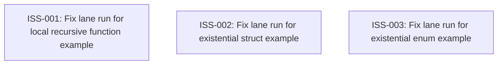

# Markdown Issue Index

Generated by derive-tracker.wasm

## Ready Queue

| ID | Priority | Type | Assignee | Title | Labels |
| --- | ---: | --- | --- | --- | --- |
| [ISS-003](ISS-003.md) | 2 | bug | unassigned | Fix lane run for existential enum example | area/example, area/existential, area/patterns, area/buslane, agent |

## Unresolved Issues

| ID | Status | Priority | Type | Assignee | Blocked by | Blocks | Title |
| --- | --- | ---: | --- | --- | --- | --- | --- |
| [ISS-003](ISS-003.md) | open | 2 | bug | unassigned | none | none | Fix lane run for existential enum example |

## Dependency Graph

## Warnings

None.

